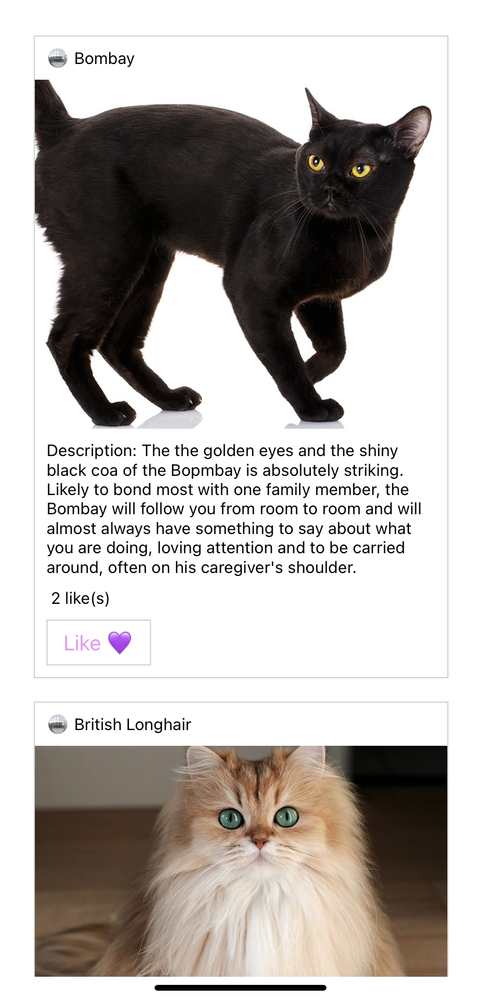

# Caturday

Caturday is a project that simulates a social media platform, but specifically for discovering pictures of cats. The app fetches all cat breed information, including images and descriptions from an API and allows users to browse and like their favorite cat pictures.

## Project Status

Caturday is a still raw project. This project aimed at learning the basics of mobile app development with React Native.

## Features

- Browse a feed of cat pictures.
- Like your favorite cat images.
- User-friendly interface designed for mobile devices.

## Technologies Used

- React Native
- Expo
- Open Cat API

## Credits

**Data Source**

- Cat breed information fetched from The Cat API (https://thecatapi.com/)
